# Akinal SQL Structure Diagram Package

Documentation-only package. Dashboard appearance, backend behavior, schema, migrations, and data were not changed.

Generated files:

- `docs/AKINAL_SQL_STRUCTURE_DIAGRAM.md`
- `docs/AKINAL_SQL_STRUCTURE_DIAGRAM.mmd`
- `docs/AKINAL_SQL_STRUCTURE_DIAGRAM.dbml`

Inputs used:

- `public_html/install-schema.php`
- `public_html/api/**/*.php`
- `src/**/*.ts`
- `src/**/*.tsx`
- `docs/DATABASE_RELATIONSHIP_AND_USAGE_MAP.md`
- `docs/FINANCE_DASHBOARD_CALCULATION_INPUT_MAP.md`

## Domain Groups

| Domain | Tables | Notes |
| --- | --- | --- |
| Public/content | `ak_site_settings`, `ak_contact_requests`, `ak_cookie_consents` | Public site settings, public lead capture, cookie consent log. |
| Project | `ak_projects`, `ak_project_images` | Public/admin project catalog and galleries. |
| CRM | `ak_customers`, `ak_customer_projects`, `ak_customer_notes`, `ak_documents` | Customer master data, project links, notes, document metadata. |
| Finance | `ak_payment_plans`, `ak_payments`, `ak_expenses`, `ak_financial_entries`, `ak_payment_plan_settlements`, `ak_employees`, `ak_expense_cards` | Planning schedules, actual source tables, canonical ledger, settlement bridge, personnel/supplier dimensions. |
| Admin/system | `ak_admin_users`, `ak_notifications`, `ak_push_subscriptions` | Admin auth, notifications, browser push subscriptions. `ak_push_subscriptions` is runtime-created by `push-utils.php`, not the main installer list. |
| Unused/legacy candidates | `ak_profiles`, `ak_user_roles`, `ak_media_library` | Present in schema or migration map, but current PHP runtime primarily uses other tables. Do not delete yet. |

## Finance Source Roles

| Table | Source role | Current calculation use |
| --- | --- | --- |
| `ak_payment_plans` | Planned schedule/source input | Receivable/payable schedules, overdue/upcoming amounts, payment status, plan tabs, payable obligations. |
| `ak_payments` | Actual collection source input | Collections screen and legacy actual income source. Still read by dashboard/report/statement code. |
| `ak_expenses` | Actual expense source input | Expenses screen and legacy actual expense source. Still read by dashboard/report/statement code. |
| `ak_financial_entries` | Canonical ledger / preferred calculation source | Preferred ledger for finance statements, dashboard cards, realized cash, project/personnel/supplier metrics, canonical read model. |
| `ak_payment_plan_settlements` | Canonical allocation bridge | Schema support for allocating ledger entries to payment plans; not yet the dominant dashboard read path. |

Double counting risk exists when dashboard/report/statement code sums both source tables and ledger rows, especially:

- `ak_financial_entries + ak_payments`
- `ak_financial_entries + ak_expenses`
- `ak_payment_plans + ak_financial_entries` planned payable obligations
- `ak_payment_plans + ak_payments` remaining/paid allocation logic

## Table Catalog

### Public/content

#### `ak_site_settings`

Primary key: `id`

Columns: `id`, `company_name`, `phone`, `whatsapp_number`, `email`, `address`, `map_embed_url`, `instagram_url`, `facebook_url`, `linkedin_url`, `footer_description`, `hero_title`, `hero_subtitle`, `whatsapp_message`, `seo_title`, `seo_description`, `updated_at`

Writes: admin settings screen `/admin/ayarlar` via `/api/admin/site-settings.php`.

Reads: public layout/header/footer/contact via `/api/site-settings.php`; admin settings; admin media protected-image discovery.

Calculation reads: no finance calculations.

#### `ak_contact_requests`

Primary key: `id`

Columns: `id`, `full_name`, `phone`, `email`, `service_type`, `message`, `status`, `created_at`

Writes: public contact form `/iletisim` via `/api/contact-request.php`.

Reads: admin contacts `/admin/talepler`, dashboard contact counts, reports.

Calculation reads: dashboard `total_contact_requests`, `new_contact_requests`; reports aggregate contact count.

#### `ak_cookie_consents`

Primary key: `id`

Columns: `id`, `consent_status`, `necessary`, `analytics`, `marketing`, `user_agent`, `created_at`

Writes: public cookie banner via `/api/cookie-consent.php`.

Reads: no current dashboard/report screen found.

Calculation reads: none.

### Project

#### `ak_projects`

Primary key: `id`

Columns: `id`, `title`, `slug`, `short_description`, `detailed_description`, `project_type`, `project_status`, `location`, `city`, `district`, `start_year`, `delivery_year`, `land_area`, `construction_area`, `apartment_count`, `floor_count`, `block_count`, `cover_image_url`, `is_featured`, `is_published`, `sort_order`, `seo_title`, `seo_description`, `created_at`, `updated_at`

Writes: admin projects `/admin/projeler`, project create/edit `/admin/projeler/yeni`, `/admin/projeler/:id`, import scripts.

Reads: public home/projects/detail, admin project list/edit/media, dashboard active project list, reports, finance statements.

Calculation reads: project counts, active/published/draft counts, project financial cards, project profitability, reports project finance, financial statement project entity, drilldowns.

#### `ak_project_images`

Primary key: `id`

Columns: `id`, `project_id`, `image_url`, `thumbnail_url`, `title`, `alt_text`, `sort_order`, `created_at`

Real foreign keys: `project_id -> ak_projects.id`

Writes: admin project image editor, upload/media endpoints.

Reads: public project detail gallery, admin project edit, admin media library.

Calculation reads: none.

### CRM

#### `ak_customers`

Primary key: `id`

Columns: `id`, `customer_type`, `full_name`, `company_name`, `phone`, `whatsapp`, `email`, `tax_or_identity_number`, `address`, `city`, `district`, `status`, `notes`, `created_at`, `updated_at`

Writes: admin customer create/edit `/admin/musteriler/yeni`, `/admin/musteriler/:id/duzenle`, quick-create customer.

Reads: customers list/detail, collections, expenses, reports, dashboard customer cards, financial statements.

Calculation reads: customer count, customer plan buckets/cards, reports customer payment, payment allocation grouping, statement entity, drilldowns.

#### `ak_customer_projects`

Primary key: `id`

Columns: `id`, `customer_id`, `project_id`, `created_at`

Real foreign keys: `customer_id -> ak_customers.id`, `project_id -> ak_projects.id`

Writes: customer create/edit through `replace_customer_projects()`.

Reads: customer list/detail, reports.

Calculation reads: report/customer context only; no primary finance formula.

#### `ak_customer_notes`

Primary key: `id`

Columns: `id`, `customer_id`, `note`, `created_at`

Real foreign keys: `customer_id -> ak_customers.id`

Writes: customer detail note action.

Reads: customer detail.

Calculation reads: none.

#### `ak_documents`

Primary key: `id`

Columns: `id`, `customer_id`, `project_id`, `title`, `document_type`, `file_url`, `notes`, `created_at`

Real foreign keys: `customer_id -> ak_customers.id`, `project_id -> ak_projects.id`

Soft keys: `ak_financial_entries.document_id -> ak_documents.id`

Writes: no complete current upload/CRUD screen found.

Reads: customer detail document list; possible soft link from ledger.

Calculation reads: no direct calculation; document links can decorate financial entries.

### Finance

#### `ak_payment_plans`

Primary key: `id`

Columns: `id`, `customer_id`, `employee_id`, `expense_card_id`, `project_id`, `business_transaction_id`, `counterparty_type`, `counterparty_id`, `direction`, `currency`, `allocation_scope`, `allocation_note`, `category_code`, `subcategory_code`, `migration_confidence`, `reconciliation_status`, `archived_at`, `archived_by`, `canceled_at`, `canceled_by`, `cancellation_reason`, `title`, `description`, `amount`, `paid_amount`, `payment_method`, `transaction_reference`, `card_note`, `cheque_maturity_date`, `cheque_no`, `bank_name`, `promissory_maturity_date`, `account_type`, `due_date`, `status`, `notes`, `created_at`, `updated_at`

Real foreign keys: `customer_id -> ak_customers.id`, `project_id -> ak_projects.id`

Soft/inferred keys: `employee_id -> ak_employees.id`, `expense_card_id -> ak_expense_cards.id`, `business_transaction_id -> ak_financial_entries.business_transaction_id`, `counterparty_type/counterparty_id -> polymorphic counterparty`, `archived_by/canceled_by -> ak_admin_users.id`

Writes: customer finance plan tabs, payment plan API, payments API status updates, statement plan dialogs.

Reads: dashboard overdue/upcoming collections, customer/project/supplier/personnel cards, cashflow forecast, notifications, reports, financial statements, finance summary.

Calculation reads: planned schedule/source input; remaining, paid, overdue, upcoming, current receivables, current payables, payment status distribution, report overdue amounts.

#### `ak_payments`

Primary key: `id`

Columns: `id`, `customer_id`, `project_id`, `payment_plan_id`, `amount`, `account_type`, `payment_date`, `payment_method`, `description`, `document_url`, `created_at`, `updated_at`

Real foreign keys: `customer_id -> ak_customers.id`, `project_id -> ak_projects.id`, `payment_plan_id -> ak_payment_plans.id`

Writes: collections screen `/admin/tahsilatlar`, upload payment document.

Reads: dashboard summary/monthly/recent movement, plan allocation, finance summary, reports, financial statements.

Calculation reads: actual collection source input; legacy income. High double counting risk if same collection exists in `ak_financial_entries`.

#### `ak_expenses`

Primary key: `id`

Columns: `id`, `project_id`, `customer_id`, `title`, `category`, `amount`, `expense_date`, `description`, `document_url`, `created_at`, `updated_at`

Real foreign keys: `project_id -> ak_projects.id`, `customer_id -> ak_customers.id`

Writes: expenses screen `/admin/giderler`, upload expense document.

Reads: dashboard summary/monthly/recent movement, finance summary, reports, project/customer statements.

Calculation reads: actual expense source input; legacy expense. High double counting risk if same expense exists in `ak_financial_entries`.

#### `ak_financial_entries`

Primary key: `id`

Columns: `id`, `project_id`, `entry_date`, `business_transaction_id`, `event_type`, `source_type`, `source_id`, `source_version`, `payment_plan_id`, `parent_entry_id`, `counterparty_type`, `counterparty_id`, `account_type`, `allocation_scope`, `allocation_note`, `transaction_date`, `due_date`, `exchange_rate`, `base_amount`, `category_code`, `subcategory_code`, `document_id`, `migration_confidence`, `reconciliation_status`, `archived_at`, `archived_by`, `canceled_at`, `canceled_by`, `cancellation_reason`, `reversal_entry_id`, `card_type`, `customer_id`, `employee_id`, `expense_card_id`, `title`, `description`, `amount`, `currency_tag`, `group_tag`, `direction`, `status`, `document_url`, `created_at`, `updated_at`

Real foreign keys: `project_id -> ak_projects.id`, `customer_id -> ak_customers.id`, `employee_id -> ak_employees.id`, `expense_card_id -> ak_expense_cards.id`

Soft/inferred keys: `payment_plan_id -> ak_payment_plans.id`, `parent_entry_id/reversal_entry_id -> ak_financial_entries.id`, `source_type/source_id -> polymorphic source`, `document_id -> ak_documents.id`, `archived_by/canceled_by -> ak_admin_users.id`

Writes: financial statement screens and canonical transaction service.

Reads: dashboard, finance summary, reports, financial statements, canonical read model, cashflow forecast, drilldowns.

Calculation reads: canonical ledger/preferred calculation source for realized income, realized expense, planned ledger amounts, cash position, profit, official/unofficial balances.

#### `ak_payment_plan_settlements`

Primary key: `id`

Columns: `id`, `payment_plan_id`, `financial_entry_id`, `allocated_amount`, `currency`, `account_type`, `created_by`, `created_at`, `reversed_at`, `reversed_by`, `reversal_reason`, `active_pair_guard`

Real foreign keys: `payment_plan_id -> ak_payment_plans.id`, `financial_entry_id -> ak_financial_entries.id`, `created_by -> ak_admin_users.id`, `reversed_by -> ak_admin_users.id`

Writes: schema supports canonical settlement allocation.

Reads: not the dominant current dashboard path found in the reviewed dashboard/report screens.

Calculation reads: intended canonical allocation bridge; future source for paid/remaining settlement truth.

#### `ak_employees`

Primary key: `id`

Columns: `id`, `full_name`, `phone`, `role`, `notes`, `status`, `created_at`, `updated_at`

Writes: personnel screen `/admin/personeller`.

Reads: personnel finance, dashboard personnel cards, payable obligations, financial statements.

Calculation reads: personnel costs, remaining personnel payables, personnel drilldowns.

#### `ak_expense_cards`

Primary key: `id`

Columns: `id`, `name`, `category`, `description`, `status`, `created_at`, `updated_at`

Writes: expense card screen `/admin/gider-kartlari`, quick-create expense category.

Reads: supplier/expense-card finance, dashboard supplier cards, expense category intelligence.

Calculation reads: supplier purchases, supplier payables, category grouping.

### Admin/system

#### `ak_admin_users`

Primary key: `id`

Columns: `id`, `email`, `email_lower`, `password_hash`, `role`, `is_active`, `created_at`, `updated_at`

Writes: `create-admin-user.php`; admin creation utility.

Reads: admin login, session guard, auth API.

Calculation reads: no finance calculation; settlement audit FK target.

#### `ak_notifications`

Primary key: `id`

Columns: `id`, `title`, `message`, `type`, `priority`, `related_customer_id`, `related_project_id`, `related_payment_plan_id`, `is_read`, `created_at`

Real foreign keys: `related_customer_id -> ak_customers.id`, `related_project_id -> ak_projects.id`, `related_payment_plan_id -> ak_payment_plans.id`

Writes: public contact request, notification generation, notification center updates.

Reads: notification bell, notification center, dashboard unread count.

Calculation reads: unread notification count only.

#### `ak_push_subscriptions`

Primary key: `id`

Columns: `id`, `admin_id`, `endpoint`, `endpoint_hash`, `p256dh`, `auth`, `user_agent`, `created_at`, `updated_at`, `last_used_at`

Soft/inferred keys: `admin_id -> ak_admin_users.id`

Writes: push subscription panel/endpoints. Created lazily by `ensure_push_subscriptions_table()`.

Reads: push send/test/debug utilities.

Calculation reads: none.

### Unused/legacy candidates

#### `ak_profiles`

Primary key: `id`

Columns: `id`, `user_id`, `email`, `display_name`, `created_at`

Real foreign keys: `user_id -> ak_admin_users.id`

Current finding: Supabase-era profile table; current PHP auth primarily reads `ak_admin_users`.

#### `ak_user_roles`

Primary key: `id`

Columns: `id`, `user_id`, `role`, `created_at`

Real foreign keys: `user_id -> ak_admin_users.id`

Current finding: Supabase-era role table; current PHP auth uses `ak_admin_users.role`.

#### `ak_media_library`

Primary key: `id`

Columns: `id`, `image_url`, `thumbnail_url`, `file_name`, `title`, `alt_text`, `related_project_id`, `created_at`

Real foreign keys: `related_project_id -> ak_projects.id`

Current finding: current media API uses `ak_project_images`, `ak_projects.cover_image_url`, image-like `ak_site_settings` fields, and filesystem uploads rather than this table.

## Real Foreign Keys

| From | To | Delete behavior |
| --- | --- | --- |
| `ak_profiles.user_id` | `ak_admin_users.id` | cascade |
| `ak_user_roles.user_id` | `ak_admin_users.id` | cascade |
| `ak_project_images.project_id` | `ak_projects.id` | cascade |
| `ak_media_library.related_project_id` | `ak_projects.id` | set null |
| `ak_customer_projects.customer_id` | `ak_customers.id` | cascade |
| `ak_customer_projects.project_id` | `ak_projects.id` | cascade |
| `ak_payment_plans.customer_id` | `ak_customers.id` | set null |
| `ak_payment_plans.project_id` | `ak_projects.id` | set null |
| `ak_payments.customer_id` | `ak_customers.id` | set null |
| `ak_payments.project_id` | `ak_projects.id` | set null |
| `ak_payments.payment_plan_id` | `ak_payment_plans.id` | set null |
| `ak_expenses.project_id` | `ak_projects.id` | set null |
| `ak_expenses.customer_id` | `ak_customers.id` | set null |
| `ak_customer_notes.customer_id` | `ak_customers.id` | cascade |
| `ak_documents.customer_id` | `ak_customers.id` | set null |
| `ak_documents.project_id` | `ak_projects.id` | set null |
| `ak_notifications.related_customer_id` | `ak_customers.id` | set null |
| `ak_notifications.related_project_id` | `ak_projects.id` | set null |
| `ak_notifications.related_payment_plan_id` | `ak_payment_plans.id` | set null |
| `ak_financial_entries.project_id` | `ak_projects.id` | set null |
| `ak_financial_entries.customer_id` | `ak_customers.id` | set null |
| `ak_financial_entries.employee_id` | `ak_employees.id` | set null |
| `ak_financial_entries.expense_card_id` | `ak_expense_cards.id` | set null |
| `ak_payment_plan_settlements.payment_plan_id` | `ak_payment_plans.id` | restrict |
| `ak_payment_plan_settlements.financial_entry_id` | `ak_financial_entries.id` | restrict |
| `ak_payment_plan_settlements.created_by` | `ak_admin_users.id` | restrict |
| `ak_payment_plan_settlements.reversed_by` | `ak_admin_users.id` | restrict |

## Soft/Inferred Keys

| From | Inferred target | Evidence |
| --- | --- | --- |
| `ak_payment_plans.employee_id` | `ak_employees.id` | dashboard payable/personnel cards and employee statement plan filters |
| `ak_payment_plans.expense_card_id` | `ak_expense_cards.id` | dashboard payable/supplier cards and expense-card statement plan filters |
| `ak_payment_plans.counterparty_type/counterparty_id` | polymorphic customer/employee/expense-card | indexed in schema, canonical planning fields |
| `ak_payment_plans.archived_by/canceled_by` | `ak_admin_users.id` | audit field naming |
| `ak_financial_entries.payment_plan_id` | `ak_payment_plans.id` | indexed in schema and canonical settlement/read model fields |
| `ak_financial_entries.parent_entry_id` | `ak_financial_entries.id` | ledger parent/child field |
| `ak_financial_entries.reversal_entry_id` | `ak_financial_entries.id` | ledger reversal field |
| `ak_financial_entries.source_type/source_id` | polymorphic source tables | canonical transaction service fetches by source type/id |
| `ak_financial_entries.counterparty_type/counterparty_id` | polymorphic customer/employee/expense-card | indexed canonical counterparty fields |
| `ak_financial_entries.document_id` | `ak_documents.id` | document field naming and prior usage map |
| `ak_financial_entries.archived_by/canceled_by` | `ak_admin_users.id` | audit field naming |
| `ak_push_subscriptions.admin_id` | `ak_admin_users.id` | push API stores current admin id |

## Mermaid ER Diagram

See the standalone Mermaid file: `docs/AKINAL_SQL_STRUCTURE_DIAGRAM.mmd`.

```mermaid
erDiagram
  ak_admin_users ||--o| ak_profiles : "FK user_id"
  ak_admin_users ||--o{ ak_user_roles : "FK user_id"
  ak_projects ||--o{ ak_project_images : "FK project_id"
  ak_projects ||--o{ ak_customer_projects : "FK project_id"
  ak_customers ||--o{ ak_customer_projects : "FK customer_id"
  ak_customers ||--o{ ak_payment_plans : "FK customer_id"
  ak_projects ||--o{ ak_payment_plans : "FK project_id"
  ak_payment_plans ||--o{ ak_payments : "FK payment_plan_id"
  ak_customers ||--o{ ak_payments : "FK customer_id"
  ak_projects ||--o{ ak_payments : "FK project_id"
  ak_projects ||--o{ ak_expenses : "FK project_id"
  ak_customers ||--o{ ak_expenses : "FK customer_id"
  ak_customers ||--o{ ak_customer_notes : "FK customer_id"
  ak_customers ||--o{ ak_documents : "FK customer_id"
  ak_projects ||--o{ ak_documents : "FK project_id"
  ak_customers ||--o{ ak_notifications : "FK related_customer_id"
  ak_projects ||--o{ ak_notifications : "FK related_project_id"
  ak_payment_plans ||--o{ ak_notifications : "FK related_payment_plan_id"
  ak_projects ||--o{ ak_financial_entries : "FK project_id"
  ak_customers ||--o{ ak_financial_entries : "FK customer_id"
  ak_employees ||--o{ ak_financial_entries : "FK employee_id"
  ak_expense_cards ||--o{ ak_financial_entries : "FK expense_card_id"
  ak_payment_plans ||--o{ ak_payment_plan_settlements : "FK payment_plan_id"
  ak_financial_entries ||--o{ ak_payment_plan_settlements : "FK financial_entry_id"
```

## DBML Diagram

See the standalone DBML file for dbdiagram.io: `docs/AKINAL_SQL_STRUCTURE_DIAGRAM.dbml`.

## Input Screens That Write Tables

| Table | Input screens/endpoints |
| --- | --- |
| `ak_admin_users` | `create-admin-user.php`; admin login reads only |
| `ak_site_settings` | `/admin/ayarlar`, `/api/admin/site-settings.php` |
| `ak_contact_requests` | public `/iletisim`, `/api/contact-request.php`; admin status update |
| `ak_cookie_consents` | public cookie banner, `/api/cookie-consent.php` |
| `ak_projects` | `/admin/projeler`, `/admin/projeler/yeni`, `/admin/projeler/:id`, project import |
| `ak_project_images` | `/admin/projeler/:id`, `/admin/medya`, project image upload |
| `ak_customers` | `/admin/musteriler`, `/admin/musteriler/yeni`, `/admin/musteriler/:id/duzenle`, quick create |
| `ak_customer_projects` | customer create/edit project assignments |
| `ak_customer_notes` | customer detail note action |
| `ak_documents` | no complete current write UI found |
| `ak_payment_plans` | customer/personnel/expense-card finance plan dialogs; payment plan API; payment status updates |
| `ak_payments` | `/admin/tahsilatlar` collections screen |
| `ak_expenses` | `/admin/giderler` expenses screen |
| `ak_financial_entries` | project/customer/personnel/expense-card finance statement screens; canonical transaction service |
| `ak_payment_plan_settlements` | canonical allocation schema support; no dominant current UI found |
| `ak_employees` | `/admin/personeller` |
| `ak_expense_cards` | `/admin/gider-kartlari`, quick expense category |
| `ak_notifications` | public contact request notification insert; notification generation; notification center read/delete |
| `ak_push_subscriptions` | admin push notification panel |
| `ak_profiles` | no active current PHP UI found |
| `ak_user_roles` | no active current PHP UI found |
| `ak_media_library` | no active current runtime writer found |

## Calculation Read Map

| Table | Dashboard reads | Finance summary reads | Reports reads | Financial statement reads |
| --- | --- | --- | --- | --- |
| `ak_projects` | project counts, active projects, project cards, labels | project cards/lookups | project finance report, filters | project entity/lookups |
| `ak_customers` | customer count, customer cards, plan labels | customer lookups | customer reports/filters | customer entity/lookups |
| `ak_payment_plans` | overdue/upcoming collections, customer cards, payables, cash forecast, notifications | payment status distribution, upcoming/overdue tables | customer payment, overdue report | plan account tabs |
| `ak_payments` | total payments, month income, recent movements, payment allocation | synthetic realized income and plan status | collections report, synthetic income | customer/project legacy rows, customer plan allocation |
| `ak_expenses` | total expenses, month expenses, recent movements | synthetic realized expense | expense report, synthetic expense | customer/project legacy rows |
| `ak_financial_entries` | canonical realized income/expense, cash, profit, category intelligence, drilldowns | canonical ledger summary | project/general summary through ledger rows | statement entries and cards |
| `ak_employees` | personnel cards/payable labels | not primary except lookups through statements | statement/report context | employee entity/lookups |
| `ak_expense_cards` | supplier cards/category labels | not primary except lookups through statements | statement/report context | expense-card entity/lookups |
| `ak_contact_requests` | contact counts | none | contact report aggregate | none |
| `ak_notifications` | unread count | none | none | none |

## Single Source of Truth Rules

These are documentation rules for future cleanup planning. They do not change behavior today.

1. `ak_financial_entries` should be the preferred source for canonical ledger calculations: realized income, realized expense, cash position, official/unofficial balances, project profit, personnel/supplier realized costs.
2. `ak_payment_plans` should remain the planned schedule/source input: receivable schedules, payable schedules, due dates, planned amount, remaining plan amount, and follow-up queues.
3. `ak_payments` should be treated as the actual collection source input while legacy collection workflows still write it.
4. `ak_expenses` should be treated as the actual expense source input while legacy expense workflows still write it.
5. A dashboard/report metric must not add `ak_payments` or `ak_expenses` to `ak_financial_entries` unless it has a clear de-duplication rule using `source_type/source_id`, settlement rows, or another stable source identity.
6. Payment plan paid/remaining calculations should eventually move from heuristic `paid_amount + ak_payments` allocation toward `ak_payment_plan_settlements`.
7. Planned payable calculations must not count the same obligation from both `ak_payment_plans` and planned `ak_financial_entries` unless the signature/de-duplication rule is explicit and tested.
8. Dashboard UI and user workflows must remain unchanged while source-of-truth cleanup is planned.

## Cleanup Candidates — Do Not Delete Yet

| Candidate | Why it looks cleanup-worthy | Why not delete yet |
| --- | --- | --- |
| `ak_media_library` | Current media API does not actively use it; media comes from `ak_project_images`, project cover URLs, settings image fields, and filesystem uploads. | It may contain migrated media or future library metadata; inspect production rows first. |
| `ak_profiles` | Current PHP auth uses `ak_admin_users`; no active profile screen found. | It has a real FK to admin users and may preserve Supabase migration context. |
| `ak_user_roles` | Current PHP auth uses `ak_admin_users.role`. | It may be useful if multi-role authorization is restored. |
| `ak_documents` | Read on customer detail, but complete write/upload flow is limited. | Customer document metadata may still be valuable; also soft-linked from `ak_financial_entries.document_id`. |
| `ak_payments` | Current known production count is 0; actual collection data may be migrating to ledger. | Collections UI and many calculations still read/write it. Do not remove until ledger-only collection workflow is complete. |
| `ak_expenses` | Current known production count is 0; actual expenses may be migrating to ledger. | Expenses UI and many calculations still read/write it. Do not remove until ledger-only expense workflow is complete. |
| Soft FK columns on `ak_financial_entries` | Some are not enforced by MySQL. | They are part of canonical transaction/cleanup planning and should be validated before removal or FK hardening. |

## Validation

- Read-only file/code inspection only.
- No destructive commands were run.
- No migrations were created.
- No runtime files were modified.
- No dashboard UI, backend behavior, schema, or data was changed.

Changed files:

- `docs/AKINAL_SQL_STRUCTURE_DIAGRAM.md`
- `docs/AKINAL_SQL_STRUCTURE_DIAGRAM.mmd`
- `docs/AKINAL_SQL_STRUCTURE_DIAGRAM.dbml`
