# Database Relationship and Usage Map

## 1. Executive Summary

This map is based on the current MySQL installer schema in `public_html/install-schema.php`, the PHP API under `public_html/api`, and the React routes/API client under `src`.

### Core tables

| Table | Role |
| --- | --- |
| `ak_projects` | Public and admin project catalog; project detail, covers, galleries, finance attribution, customer links. |
| `ak_project_images` | Project gallery image rows; also the main database-backed source for the admin media library. |
| `ak_site_settings` | Public site identity/contact/SEO/settings data and admin settings screen. |
| `ak_admin_users` | PHP admin login/session identity. |
| `ak_customers` | CRM customer master table; feeds customer lists, customer detail, collections, receivables, statements, reports. |
| `ak_customer_projects` | Customer-project many-to-many join table. |
| `ak_payment_plans` | Planned receivables/payables, reminders, dashboard follow-ups, statement open items. |
| `ak_payments` | Legacy/operational collection records; used by collections, dashboards, reports, and customer statements. |
| `ak_expenses` | Legacy/operational expense records; used by expenses, dashboards, reports, and project/customer statements. |
| `ak_financial_entries` | Canonical multi-currency financial ledger for project/customer/personnel/expense-card statements and finance dashboards. |
| `ak_employees` | Personnel cards and personnel finance statements. |
| `ak_expense_cards` | Supplier/expense category cards and expense-card finance statements. |
| `ak_notifications` | Admin notification center, header bell, contact request alerts, and payment reminders. |

### Supporting tables

| Table | Role |
| --- | --- |
| `ak_contact_requests` | Public contact form submissions and admin contact requests screen. |
| `ak_customer_notes` | Notes on customer detail records. |
| `ak_documents` | Customer/project document metadata shown on customer detail; upload CRUD is limited in current UI. |
| `ak_cookie_consents` | Public cookie consent audit rows. |
| `ak_push_subscriptions` | Admin browser push subscriptions; created lazily by `push-utils.php`, not by the main installer. |
| `ak_profiles` | Supabase-era/admin profile table linked to `ak_admin_users`; not used by current PHP auth flow. |
| `ak_user_roles` | Supabase-era/admin role table linked to `ak_admin_users`; current PHP auth uses `ak_admin_users.role`. |

### Possibly unused/dead tables

| Table | Finding |
| --- | --- |
| `ak_media_library` | Defined with `related_project_id`, but current media API reads `ak_project_images`, `ak_projects.cover_image_url`, image-like `ak_site_settings` fields, and filesystem uploads. No current runtime query writes/reads `ak_media_library`. |
| `ak_profiles` | Defined and mapped from Supabase, but current admin session endpoints read only `ak_admin_users`. |
| `ak_user_roles` | Defined and mapped from Supabase, but current authorization is role string on `ak_admin_users`. |
| `ak_documents` | Read on customer detail, but current API set does not expose full document create/upload CRUD. Treat as partially wired. |

### Demo-data-heavy tables

Seed and smoke-test scripts reference the operational finance/CRM tables heavily:

| Table group | Evidence |
| --- | --- |
| CRM/project demo set | `scripts/seed-demo-bulk.mjs`, `scripts/seed-smoke-test.mjs`, and `supabase/manual/akinal_real_demo_seed.sql` target customers, projects, customer-project links, payment plans, payments, expenses, employees, expense cards, financial entries, and notifications. |
| Finance reconciliation set | `tools/sql/canonical_cashflow_classifier_queries.sql` and `docs/sql/phase_3a_reconciliation_inventory.sql` repeatedly analyze `ak_payment_plans`, `ak_payments`, `ak_expenses`, `ak_financial_entries`, `ak_customers`, `ak_employees`, `ak_expense_cards`, and `ak_projects`. |

## 2. Table Relationship Map

Legend:

- `enforced`: declared as a MySQL foreign key in the installer.
- `soft/inferred`: indexed or used by code as a relationship, but not enforced by the current installer schema.
- `polymorphic`: target depends on a type column.

| Table | Primary key | Foreign-key-like columns | Related table | Relationship type |
| --- | --- | --- | --- | --- |
| `ak_admin_users` | `id` | none | none | root admin identity table |
| `ak_profiles` | `id` | `user_id` | `ak_admin_users.id` | enforced one admin user to one profile |
| `ak_user_roles` | `id` | `user_id` | `ak_admin_users.id` | enforced one admin user to many role rows |
| `ak_projects` | `id` | none | none | root project table |
| `ak_project_images` | `id` | `project_id` | `ak_projects.id` | enforced one project to many images |
| `ak_media_library` | `id` | `related_project_id` | `ak_projects.id` | enforced optional project media ownership |
| `ak_site_settings` | `id` | none | none | singleton/latest-row settings table |
| `ak_contact_requests` | `id` | none | none | standalone inbound lead table |
| `ak_customers` | `id` | none | none | root CRM table |
| `ak_customer_projects` | `id` | `customer_id` | `ak_customers.id` | enforced many-to-many join |
| `ak_customer_projects` | `id` | `project_id` | `ak_projects.id` | enforced many-to-many join |
| `ak_payment_plans` | `id` | `customer_id` | `ak_customers.id` | enforced optional customer receivable/payable plan |
| `ak_payment_plans` | `id` | `project_id` | `ak_projects.id` | enforced optional project attribution |
| `ak_payment_plans` | `id` | `employee_id` | `ak_employees.id` | soft/inferred personnel payable plan |
| `ak_payment_plans` | `id` | `expense_card_id` | `ak_expense_cards.id` | soft/inferred expense-card payable plan |
| `ak_payment_plans` | `id` | `counterparty_type`, `counterparty_id` | `ak_customers.id`, `ak_employees.id`, or `ak_expense_cards.id` | polymorphic soft/inferred counterparty |
| `ak_payment_plans` | `id` | `business_transaction_id` | `ak_financial_entries.business_transaction_id` group | soft/inferred transaction grouping |
| `ak_payment_plans` | `id` | `archived_by`, `canceled_by` | `ak_admin_users.id` | soft/inferred admin audit fields |
| `ak_payments` | `id` | `customer_id` | `ak_customers.id` | enforced optional collection owner |
| `ak_payments` | `id` | `project_id` | `ak_projects.id` | enforced optional project attribution |
| `ak_payments` | `id` | `payment_plan_id` | `ak_payment_plans.id` | enforced optional collection allocation to a plan |
| `ak_expenses` | `id` | `project_id` | `ak_projects.id` | enforced optional project expense |
| `ak_expenses` | `id` | `customer_id` | `ak_customers.id` | enforced optional customer-related expense |
| `ak_customer_notes` | `id` | `customer_id` | `ak_customers.id` | enforced one customer to many notes |
| `ak_documents` | `id` | `customer_id` | `ak_customers.id` | enforced optional customer document |
| `ak_documents` | `id` | `project_id` | `ak_projects.id` | enforced optional project document |
| `ak_notifications` | `id` | `related_customer_id` | `ak_customers.id` | enforced optional notification target |
| `ak_notifications` | `id` | `related_project_id` | `ak_projects.id` | enforced optional notification target |
| `ak_notifications` | `id` | `related_payment_plan_id` | `ak_payment_plans.id` | enforced optional notification target |
| `ak_employees` | `id` | none | none | root personnel table |
| `ak_expense_cards` | `id` | none | none | root supplier/expense-card table |
| `ak_financial_entries` | `id` | `project_id` | `ak_projects.id` | enforced optional project ledger attribution |
| `ak_financial_entries` | `id` | `customer_id` | `ak_customers.id` | enforced optional customer statement owner |
| `ak_financial_entries` | `id` | `employee_id` | `ak_employees.id` | enforced optional employee statement owner |
| `ak_financial_entries` | `id` | `expense_card_id` | `ak_expense_cards.id` | enforced optional expense-card statement owner |
| `ak_financial_entries` | `id` | `payment_plan_id` | `ak_payment_plans.id` | soft/inferred plan link; indexed but no FK in installer |
| `ak_financial_entries` | `id` | `parent_entry_id` | `ak_financial_entries.id` | soft/inferred parent/child ledger relationship |
| `ak_financial_entries` | `id` | `reversal_entry_id` | `ak_financial_entries.id` | soft/inferred reversal relationship |
| `ak_financial_entries` | `id` | `source_type`, `source_id` | `ak_payments.id`, `ak_expenses.id`, `ak_payment_plans.id`, or other source | polymorphic soft/inferred source mapping |
| `ak_financial_entries` | `id` | `counterparty_type`, `counterparty_id` | `ak_customers.id`, `ak_employees.id`, or `ak_expense_cards.id` | polymorphic soft/inferred counterparty |
| `ak_financial_entries` | `id` | `document_id` | `ak_documents.id` | soft/inferred document link |
| `ak_financial_entries` | `id` | `archived_by`, `canceled_by` | `ak_admin_users.id` | soft/inferred admin audit fields |
| `ak_cookie_consents` | `id` | none | none | standalone public consent log |
| `ak_push_subscriptions` | `id` | `admin_id` | `ak_admin_users.id` | soft/inferred admin subscription owner; lazily created without FK |

## 3. Mermaid ER Diagram

```mermaid
erDiagram
  ak_admin_users ||--o| ak_profiles : user_id
  ak_admin_users ||--o{ ak_user_roles : user_id
  ak_admin_users ||--o{ ak_push_subscriptions : admin_id_soft

  ak_projects ||--o{ ak_project_images : project_id
  ak_projects ||--o{ ak_media_library : related_project_id
  ak_projects ||--o{ ak_customer_projects : project_id
  ak_projects ||--o{ ak_payment_plans : project_id
  ak_projects ||--o{ ak_payments : project_id
  ak_projects ||--o{ ak_expenses : project_id
  ak_projects ||--o{ ak_documents : project_id
  ak_projects ||--o{ ak_notifications : related_project_id
  ak_projects ||--o{ ak_financial_entries : project_id

  ak_customers ||--o{ ak_customer_projects : customer_id
  ak_customers ||--o{ ak_payment_plans : customer_id
  ak_customers ||--o{ ak_payments : customer_id
  ak_customers ||--o{ ak_expenses : customer_id
  ak_customers ||--o{ ak_customer_notes : customer_id
  ak_customers ||--o{ ak_documents : customer_id
  ak_customers ||--o{ ak_notifications : related_customer_id
  ak_customers ||--o{ ak_financial_entries : customer_id

  ak_payment_plans ||--o{ ak_payments : payment_plan_id
  ak_payment_plans ||--o{ ak_notifications : related_payment_plan_id
  ak_payment_plans ||--o{ ak_financial_entries : payment_plan_id_soft

  ak_employees ||--o{ ak_payment_plans : employee_id_soft
  ak_employees ||--o{ ak_financial_entries : employee_id

  ak_expense_cards ||--o{ ak_payment_plans : expense_card_id_soft
  ak_expense_cards ||--o{ ak_financial_entries : expense_card_id

  ak_documents ||--o{ ak_financial_entries : document_id_soft
  ak_financial_entries ||--o{ ak_financial_entries : parent_entry_id_soft
  ak_financial_entries ||--o{ ak_financial_entries : reversal_entry_id_soft
```

## 4. Screen, Dashboard, and API Usage Map

### Public site

| Screen/component | Route | Frontend caller | Endpoint/function | Tables read/written |
| --- | --- | --- | --- | --- |
| Public layout/header/footer | all public routes | `useSiteSettings`, `PublicLayout`, `SiteHeader`, `SiteFooter` | `getSiteSettings()` -> `GET /api/site-settings.php` | reads `ak_site_settings` |
| Home | `/` | `Home.tsx` | `getPublishedProjects()` -> `GET /api/projects.php` | reads published/featured `ak_projects` |
| Projects listing | `/projelerimiz`, `/projeler` | `Projects.tsx` | `getPublishedProjects()` -> `GET /api/projects.php` | reads published `ak_projects` |
| Project detail | `/projelerimiz/:slug` | `ProjectDetail.tsx` | `getProjectDetail(slug)` -> `GET /api/project-detail.php?slug=` | reads `ak_projects`, `ak_project_images` |
| Contact form | `/iletisim` | `Contact.tsx` | `submitContactRequest()` -> `POST /api/contact-request.php` | writes `ak_contact_requests`, writes `ak_notifications` |
| Cookie consent | site component | `CookieConsent.tsx` | `submitCookieConsent()` -> `POST /api/cookie-consent.php` | writes `ak_cookie_consents` |
| Sales chatbot | floating/site component | `SalesChatbot.tsx` | `submitSalesChatbotMessage()` -> `POST /api/sales-chatbot.php` | no direct scoped-table dependency found in current PHP endpoint search |

### Admin shell and auth

| Screen/component | Route | Frontend caller | Endpoint/function | Tables read/written |
| --- | --- | --- | --- | --- |
| Admin login | `/admin/giris` | `AdminAuth.tsx`, `useAuth` | `loginAdmin()` -> `POST /api/admin/login.php` | reads `ak_admin_users` |
| Current admin/session guard | admin routes | `useAuth`, `AdminLayout` | `getCurrentAdmin()` -> `GET /api/admin/me.php`; `public_html/api/auth.php` | reads `ak_admin_users` |
| Logout | admin routes | `useAuth`, `AdminLayout` | `logoutAdmin()` -> `POST /api/admin/logout.php` | PHP session only |
| Header notification bell | admin layout | `NotificationBell`, `useNotifications` | `getAdminNotifications()` -> `GET /api/admin/notifications.php?generate=1` | reads/writes `ak_notifications`; reads `ak_payment_plans`, `ak_payments`; related IDs to `ak_customers`, `ak_projects` |
| Push notification panel | admin layout/settings | `AdminPushNotificationsPanel` | `getAdminPushConfig()`, `subscribeAdminPush()`, `unsubscribeAdminPush()`, `sendAdminPushTest()` | reads/writes/deletes `ak_push_subscriptions`; session admin ID from `ak_admin_users` |

### Admin content and CRM screens

| Screen/component | Route | Frontend caller | Endpoint/function | Tables read/written |
| --- | --- | --- | --- | --- |
| Dashboard | `/admin` | `AdminDashboard.tsx` | `getAdminDashboard()` -> `GET /api/admin/dashboard.php` | reads `ak_projects`, `ak_contact_requests`, `ak_notifications`, `ak_customers`, `ak_payment_plans`, `ak_payments`, `ak_expenses`, `ak_financial_entries`, `ak_employees`, `ak_expense_cards` |
| Projects list | `/admin/projeler` | `AdminProjects.tsx` | `getAdminProjects()`, `deleteAdminProject()` -> `/api/admin/projects.php` | reads/writes/deletes `ak_projects` |
| Project create/edit | `/admin/projeler/yeni`, `/admin/projeler/:id` | `AdminProjectEdit.tsx` | project CRUD; `getAdminProjectImages()`, image CRUD/upload | reads/writes `ak_projects`, `ak_project_images`; upload endpoints store files and URLs |
| Project finance | `/admin/projeler/:id/finans` | `AdminProjectFinance.tsx`, `FinancialStatementPage` | `getAdminFinancialStatement("project", id)` -> `/api/admin/financial-statement.php` | reads entity from `ak_projects`; reads `ak_financial_entries`, legacy `ak_payments`, legacy `ak_expenses`; lookup reads `ak_customers`, `ak_employees`, `ak_expense_cards` |
| Media library | `/admin/medya` | `AdminMedia.tsx` | `getAdminMedia()`, `deleteAdminMediaImage()`, `uploadAdminMediaImage()` | reads/deletes `ak_project_images`; reads `ak_projects.cover_image_url`; reads image-like `ak_site_settings`; reads filesystem uploads; does not use `ak_media_library` |
| Contact requests | `/admin/talepler` | `AdminContacts.tsx` | `getAdminContactRequests()`, `updateAdminContactRequestStatus()`, `deleteAdminContactRequest()` | reads/updates/deletes `ak_contact_requests` |
| Settings | `/admin/ayarlar` | `AdminSettings.tsx` | `getAdminSiteSettings()`, `updateAdminSiteSettings()`, `uploadAdminSiteAsset()` | reads/updates `ak_site_settings` |
| Customers list | `/admin/musteriler` | `AdminCustomers.tsx` | `getAdminCustomersData()`, `deleteAdminCustomer()` | reads/deletes `ak_customers`; reads `ak_payment_plans`, `ak_payments`, `ak_customer_projects`, `ak_projects` |
| Customer create/edit | `/admin/musteriler/yeni`, `/admin/musteriler/:id/duzenle` | `AdminCustomerEdit.tsx`, `QuickCreateCustomerButton` | customer CRUD -> `/api/admin/customers.php` | writes `ak_customers`; replaces `ak_customer_projects`; reads `ak_projects` |
| Customer detail | `/admin/musteriler/:id` | `AdminCustomerDetail.tsx` | `getAdminCustomerDetail()`, note create/delete | reads `ak_customers`, `ak_customer_projects`, `ak_projects`, `ak_payment_plans`, `ak_payments`, `ak_customer_notes`, `ak_documents`; writes/deletes `ak_customer_notes` |
| Customer finance | `/admin/musteriler/:id/finans` | `AdminCustomerFinance.tsx`, `FinancialStatementPage` | `getAdminFinancialStatement("customer", id)` | reads entity from `ak_customers`; reads/writes `ak_financial_entries`; reads legacy `ak_payments`, `ak_expenses`, `ak_payment_plans`; lookups from `ak_projects`, `ak_employees`, `ak_expense_cards` |
| Employees | `/admin/personeller` | `AdminEmployees.tsx` | employee CRUD -> `/api/admin/employees.php` | reads/writes/deletes `ak_employees`; delete guard reads `ak_payment_plans`, `ak_financial_entries` |
| Employee finance | `/admin/personeller/:id/finans` | `AdminEmployeeFinance.tsx`, `FinancialStatementPage` | `getAdminFinancialStatement("employee", id)` | reads entity from `ak_employees`; reads/writes `ak_financial_entries`; reads employee `ak_payment_plans`; lookups from `ak_projects`, `ak_customers`, `ak_expense_cards` |
| Expense cards | `/admin/gider-kartlari` | `AdminExpenseCards.tsx`, `QuickCreateExpenseCategoryButton` | expense-card CRUD -> `/api/admin/expense-cards.php` | reads/writes/deletes `ak_expense_cards`; delete guard reads `ak_payment_plans`, `ak_financial_entries` |
| Expense-card finance | `/admin/gider-kartlari/:id/finans` | `AdminExpenseCardFinance.tsx`, `FinancialStatementPage` | `getAdminFinancialStatement("expense", id)` | reads entity from `ak_expense_cards`; reads/writes `ak_financial_entries`; reads expense-card `ak_payment_plans`; lookups from `ak_projects`, `ak_customers`, `ak_employees` |

### Admin finance, reports, and tools

| Screen/component | Route | Frontend caller | Endpoint/function | Tables read/written |
| --- | --- | --- | --- | --- |
| Collections | `/admin/tahsilatlar` | `AdminCollections.tsx` | payment CRUD -> `/api/admin/payments.php`; upload payment document | reads/writes/deletes `ak_payments`; reads `ak_customers`, `ak_projects`, `ak_payment_plans`; updates plan status in `ak_payment_plans` |
| Expenses | `/admin/giderler` | `AdminExpenses.tsx` | expense CRUD -> `/api/admin/expenses.php`; upload expense document | reads/writes/deletes `ak_expenses`; reads `ak_customers`, `ak_projects` |
| Finance dashboard | `/admin/finans-dashboard` | `AdminFinance.tsx` | `getAdminFinanceSummary()` -> `/api/admin/finance-summary.php`; optional backend canonical URLs in code | reads `ak_payment_plans`, `ak_payments`, `ak_expenses`, `ak_financial_entries`, `ak_customers`, `ak_projects` |
| Notifications center | `/admin/bildirimler` | `AdminNotifications.tsx` | notification CRUD/generation -> `/api/admin/notifications.php` | reads/writes/updates/deletes `ak_notifications`; generation reads `ak_payment_plans`, `ak_payments` |
| Reports | `/admin/raporlar` | `AdminReports.tsx` | `getAdminReportsData()` -> `/api/admin/reports.php` | reads `ak_customers`, `ak_payment_plans`, `ak_payments`, `ak_expenses`, `ak_financial_entries`, `ak_projects`, `ak_customer_projects`, `ak_contact_requests` |
| SQL editor | `/admin/sql-editor` | `AdminSqlEditor.tsx` | `executeAdminSql()` -> `/api/admin/sql-editor.php` | arbitrary SQL access; placeholder uses `SELECT * FROM ak_projects LIMIT 20` |
| Payment plan redirect | `/admin/odeme-planlari` | route redirect | redirects to `/admin/musteriler` | no direct screen; payment plan CRUD still exists via customer/collections APIs |

## 5. Keyword, Function, Endpoint, Query, and Component Call Map

### Endpoint to table map

| Endpoint | Main functions/queries | Tables |
| --- | --- | --- |
| `GET /api/site-settings.php` | `SELECT * FROM ak_site_settings ORDER BY updated_at DESC LIMIT 1`; schema patch for `favicon_url` | `ak_site_settings` |
| `GET /api/projects.php` | published project query | `ak_projects` |
| `GET /api/project-detail.php?slug=` | slug lookup plus gallery query | `ak_projects`, `ak_project_images` |
| `POST /api/contact-request.php` | `INSERT INTO ak_contact_requests`; `INSERT INTO ak_notifications` | `ak_contact_requests`, `ak_notifications` |
| `POST /api/cookie-consent.php` | `INSERT INTO ak_cookie_consents` | `ak_cookie_consents` |
| `POST /api/admin/login.php` | dynamic column select by `email_lower`; `password_verify()` | `ak_admin_users` |
| `GET /api/admin/me.php` / `public_html/api/auth.php` | session admin lookup by `id` | `ak_admin_users` |
| `/api/admin/projects.php` | CRUD helpers; `SELECT/INSERT/UPDATE/DELETE ak_projects` | `ak_projects` |
| `/api/admin/project-images.php` | `SELECT/INSERT/UPDATE/DELETE ak_project_images`; optional `project_id` filter | `ak_project_images` |
| `/api/admin/media.php` | `collect_media_images()`, `site_setting_image_rows()`, `filesystem_project_images()`, `delete_db_media()` | `ak_project_images`, `ak_projects`, `ak_site_settings`, filesystem uploads |
| `/api/admin/contact-requests.php` | status filter/search, status patch, delete | `ak_contact_requests` |
| `/api/admin/site-settings.php` | settings read/update; `favicon_url` schema patch | `ak_site_settings` |
| `/api/admin/customers.php` | `fetch_customer()`, `replace_customer_projects()`, note action | `ak_customers`, `ak_customer_projects`, `ak_projects`, `ak_payment_plans`, `ak_payments`, `ak_customer_notes`, `ak_documents` |
| `/api/admin/payment-plans.php` | plan CRUD, status recalculation | `ak_payment_plans`, `ak_payments`, `ak_customers`, `ak_projects` |
| `/api/admin/payments.php` | payment CRUD, `update_plan_status()` | `ak_payments`, `ak_payment_plans`, `ak_customers`, `ak_projects` |
| `/api/admin/expenses.php` | expense CRUD | `ak_expenses`, `ak_customers`, `ak_projects` |
| `/api/admin/employees.php` | employee CRUD, delete guards | `ak_employees`, `ak_payment_plans`, `ak_financial_entries` |
| `/api/admin/expense-cards.php` | expense-card CRUD, delete guards | `ak_expense_cards`, `ak_payment_plans`, `ak_financial_entries` |
| `/api/admin/financial-statement.php` | `fetch_statement_entity()`, `fetch_statement_entries()`, `financial_entry_payload()` | `ak_financial_entries`, `ak_projects`, `ak_customers`, `ak_employees`, `ak_expense_cards`, `ak_payment_plans`, `ak_payments`, `ak_expenses` |
| `/api/admin/finance-summary.php` | bulk finance summary selects | `ak_payment_plans`, `ak_payments`, `ak_expenses`, `ak_financial_entries`, `ak_customers`, `ak_projects` |
| `/api/admin/dashboard.php` | many aggregate and recent-activity queries | `ak_projects`, `ak_contact_requests`, `ak_notifications`, `ak_customers`, `ak_payment_plans`, `ak_payments`, `ak_expenses`, `ak_financial_entries`, `ak_employees`, `ak_expense_cards` |
| `/api/admin/notifications.php` | `generate_payment_notifications()`, read/delete operations | `ak_notifications`, `ak_payment_plans`, `ak_payments` |
| `/api/admin/reports.php` | report bundle selects | `ak_customers`, `ak_payment_plans`, `ak_payments`, `ak_expenses`, `ak_financial_entries`, `ak_projects`, `ak_customer_projects`, `ak_contact_requests` |
| `/api/admin/push-subscribe.php` | config action and subscription upsert | `ak_push_subscriptions` |
| `/api/admin/push-unsubscribe.php` | delete by `admin_id` and `endpoint_hash` | `ak_push_subscriptions` |
| `/api/admin/send-push-test.php` / `push-utils.php` | `send_push_to_all_admins()`, stale subscription cleanup | `ak_push_subscriptions` |
| `/api/admin/sql-editor.php` | admin-entered SQL | arbitrary; UI default references `ak_projects` |
| `/api/admin/backend-canonical-read-model.php` | canonical dashboard/read-model helper | `ak_financial_entries`, `ak_payment_plans`, `ak_payments`, `ak_expenses`, `ak_projects`, `ak_customers`, `ak_contact_requests` |
| `/api/admin/canonical-read-flags.php` | feature-flag/parity calculations | `ak_financial_entries`, `ak_payment_plans`, `ak_payments`, `ak_expenses`, `ak_projects`, `ak_customers`, `ak_contact_requests` |
| `/api/admin/canonical-transaction-service.php` | ledger transaction insert/reversal/fetch by source | `ak_financial_entries`, `ak_payment_plans` |

### Frontend API client call map

| API client function | Endpoint | Primary data sources |
| --- | --- | --- |
| `getSiteSettings` | `/api/site-settings.php` | `ak_site_settings` |
| `getPublishedProjects` | `/api/projects.php` | `ak_projects` |
| `getProjectDetail` | `/api/project-detail.php?slug=` | `ak_projects`, `ak_project_images` |
| `loginAdmin`, `getCurrentAdmin`, `logoutAdmin` | `/api/admin/login.php`, `/api/admin/me.php`, `/api/admin/logout.php` | `ak_admin_users`, PHP session |
| `submitContactRequest` | `/api/contact-request.php` | `ak_contact_requests`, `ak_notifications` |
| `submitCookieConsent` | `/api/cookie-consent.php` | `ak_cookie_consents` |
| `getAdminDashboard` | `/api/admin/dashboard.php` | dashboard aggregate tables listed above |
| `getAdminProjects`, `getAdminProject`, `createAdminProject`, `updateAdminProject`, `deleteAdminProject` | `/api/admin/projects.php` | `ak_projects` |
| `getAdminProjectImages`, `createAdminProjectImage`, `updateAdminProjectImage`, `deleteAdminProjectImage` | `/api/admin/project-images.php` | `ak_project_images` |
| `getAdminMedia`, `deleteAdminMediaImage`, `deleteAdminMediaPath`, `uploadAdminMediaImage` | `/api/admin/media.php`, `/api/admin/media-upload.php` | `ak_project_images`, `ak_projects`, `ak_site_settings`, filesystem uploads |
| `getAdminContactRequests`, `updateAdminContactRequestStatus`, `deleteAdminContactRequest` | `/api/admin/contact-requests.php` | `ak_contact_requests` |
| `getAdminSiteSettings`, `updateAdminSiteSettings` | `/api/admin/site-settings.php` | `ak_site_settings` |
| `getAdminCustomersData`, `getAdminCustomerDetail`, `createAdminCustomer`, `updateAdminCustomer`, `deleteAdminCustomer` | `/api/admin/customers.php` | `ak_customers`, `ak_customer_projects`, related CRM/finance tables |
| `createAdminCustomerNote`, `deleteAdminCustomerNote` | `/api/admin/customers.php?action=note` pattern via body/query | `ak_customer_notes` |
| `createAdminPaymentPlan`, `updateAdminPaymentPlan`, `deleteAdminPaymentPlan` | `/api/admin/payment-plans.php` | `ak_payment_plans`, `ak_payments` |
| `getAdminPaymentsData`, `createAdminPayment`, `updateAdminPayment`, `deleteAdminPayment` | `/api/admin/payments.php` | `ak_payments`, `ak_payment_plans`, `ak_customers`, `ak_projects` |
| `getAdminFinanceSummary` | `/api/admin/finance-summary.php` | `ak_payment_plans`, `ak_payments`, `ak_expenses`, `ak_financial_entries`, `ak_customers`, `ak_projects` |
| `getAdminFinancialStatement`, `createAdminFinancialEntry`, `updateAdminFinancialEntry`, `deleteAdminFinancialEntry` | `/api/admin/financial-statement.php` | `ak_financial_entries` plus statement owner/legacy finance tables |
| `getAdminExpensesData`, `createAdminExpense`, `updateAdminExpense`, `deleteAdminExpense` | `/api/admin/expenses.php` | `ak_expenses`, `ak_customers`, `ak_projects` |
| `getAdminExpenseCards`, `createAdminExpenseCard`, `updateAdminExpenseCard`, `deleteAdminExpenseCard` | `/api/admin/expense-cards.php` | `ak_expense_cards`, guarded by `ak_payment_plans`, `ak_financial_entries` |
| `getAdminEmployees`, `createAdminEmployee`, `updateAdminEmployee`, `deleteAdminEmployee` | `/api/admin/employees.php` | `ak_employees`, guarded by `ak_payment_plans`, `ak_financial_entries` |
| `getAdminNotifications`, `updateAdminNotificationRead`, `markAllAdminNotificationsRead`, `deleteAdminNotification`, `deleteAllAdminNotifications` | `/api/admin/notifications.php` | `ak_notifications`, generated from `ak_payment_plans`, `ak_payments` |
| `getAdminReportsData` | `/api/admin/reports.php` | report bundle tables listed above |
| `executeAdminSql` | `/api/admin/sql-editor.php` | arbitrary |

## 6. Table-by-Table Usage Index

| Table | Feeds screens/dashboards/APIs | Called by keywords/functions/components |
| --- | --- | --- |
| `ak_admin_users` | admin login, admin session guard, push owner context, create-admin utility | `loginAdmin`, `getCurrentAdmin`, `public_html/api/admin/login.php`, `public_html/api/auth.php`, `create-admin-user.php`, `email_lower`, `password_hash`, `require_admin()` |
| `ak_contact_requests` | public contact form, admin contact requests, dashboard contact counts, reports | `submitContactRequest`, `getAdminContactRequests`, `/api/contact-request.php`, `/api/admin/contact-requests.php`, `/api/admin/dashboard.php`, `/api/admin/reports.php` |
| `ak_cookie_consents` | public cookie banner audit | `CookieConsent`, `submitCookieConsent`, `/api/cookie-consent.php`, `INSERT INTO ak_cookie_consents` |
| `ak_customer_notes` | customer detail notes | `createAdminCustomerNote`, `deleteAdminCustomerNote`, `/api/admin/customers.php`, `action: "note"`, `SELECT * FROM ak_customer_notes WHERE customer_id` |
| `ak_customer_projects` | customer list/project badges, customer edit links, reports | `replace_customer_projects()`, `getAdminCustomersData`, `getAdminCustomerDetail`, `/api/admin/customers.php`, `/api/admin/reports.php` |
| `ak_customers` | customer CRM, customer finance, collections, expenses, dashboard, reports, notifications, financial statements | `getAdminCustomersData`, `getAdminCustomerDetail`, `createAdminCustomer`, `customer_payload()`, `getAdminPaymentsData`, `getAdminExpensesData`, `getAdminFinancialStatement("customer")`, `customerDisplayName` |
| `ak_documents` | customer detail document list; inferred ledger document link | `getAdminCustomerDetail`, `SELECT * FROM ak_documents WHERE customer_id`, `ak_financial_entries.document_id` |
| `ak_employees` | personnel list, personnel finance, dashboard personnel payable cards, reports through statements | `getAdminEmployees`, `AdminEmployees`, `getAdminFinancialStatement("employee")`, `fetch_statement_entity("employee")`, `statement_fixed_column("employee")` |
| `ak_expense_cards` | expense card list, supplier/expense-card finance, dashboard payable cards | `getAdminExpenseCards`, `AdminExpenseCards`, `QuickCreateExpenseCategoryButton`, `getAdminFinancialStatement("expense")`, `fetch_statement_entity("expense")` |
| `ak_expenses` | expenses screen, finance dashboard, dashboard recent flows, reports, project/customer statements as legacy rows | `getAdminExpensesData`, `createAdminExpense`, `fetch_statement_entries()`, `legacy-expense-`, `summarizeLedgerFinance`, `/api/admin/expenses.php` |
| `ak_financial_entries` | finance dashboard, project/customer/personnel/expense-card statements, canonical read model, dashboard cashflow panels | `getAdminFinancialStatement`, `createAdminFinancialEntry`, `financial_entry_payload()`, `fetch_statement_entries()`, `canonical-transaction-service.php`, `canonical-read-flags.php`, `backend-canonical-read-model.php` |
| `ak_media_library` | no current active screen found | schema only: `fk_media_library_project`; migration map only |
| `ak_notifications` | admin notification bell, notification center, dashboard unread count, contact request alerts, generated payment reminders | `getAdminNotifications`, `NotificationBell`, `AdminNotifications`, `generate_payment_notifications()`, `/api/contact-request.php`, `related_payment_plan_id` |
| `ak_payment_plans` | customer receivables, collections allocation, notifications/reminders, finance dashboard, reports, statements | `createAdminPaymentPlan`, `update_plan_status()`, `allocateCollectionsToPlans`, `derivePlanStatus`, `effectivePaidForPlan`, `fetch_statement_payment_plans()`, `/api/admin/notifications.php` |
| `ak_payments` | collections screen, payment plan paid status, finance dashboard, dashboard recent collections, reports, customer/project statements as legacy income | `getAdminPaymentsData`, `createAdminPayment`, `update_plan_status()`, `fetch_statement_payments()`, `legacy-payment-`, `allocateCollectionsToPlans` |
| `ak_profiles` | no current active screen found | schema only; `user_id -> ak_admin_users.id` |
| `ak_project_images` | public project detail galleries, admin project image editor, media library | `getProjectDetail`, `getAdminProjectImages`, `createAdminProjectImage`, `getAdminMedia`, `collect_media_images()`, `uploadAdminProjectImage` |
| `ak_projects` | public project pages, admin projects, customer/project links, media, dashboard, finance/report attribution | `getPublishedProjects`, `getProjectDetail`, `getAdminProjects`, `getAdminProject`, `createAdminProject`, `getAdminFinancialStatement("project")`, `projectImportExport` |
| `ak_push_subscriptions` | admin push subscribe/unsubscribe/test panel | `getAdminPushConfig`, `subscribeAdminPush`, `unsubscribeAdminPush`, `sendAdminPushTest`, `ensure_push_subscriptions_table()`, `send_push_to_all_admins()` |
| `ak_site_settings` | public header/footer/contact/site SEO, admin settings, media library protected image discovery | `useSiteSettings`, `getSiteSettings`, `getAdminSiteSettings`, `updateAdminSiteSettings`, `site_setting_image_rows()`, `uploadAdminSiteAsset` |
| `ak_user_roles` | no current active screen found | schema only; current role comes from `ak_admin_users.role` |

## 7. Relationship Notes and Risks

| Area | Note |
| --- | --- |
| Legacy finance vs canonical ledger | `ak_payments` and `ak_expenses` are still active operational tables. Statement and dashboard APIs normalize them beside `ak_financial_entries`, so deleting or bypassing them would break current screens. |
| Payment plan ownership | `ak_payment_plans.customer_id` and `project_id` are enforced FKs, but `employee_id` and `expense_card_id` are only indexed/used by code. If personnel/supplier payables are business-critical, consider adding FKs after checking existing data quality. |
| Financial entry source links | `source_type/source_id`, `payment_plan_id`, `parent_entry_id`, `reversal_entry_id`, `document_id`, and audit admin IDs are not FK-enforced in the current installer. Treat them as application-level contracts. |
| Media model split | `ak_media_library` is schema-defined but current media functionality is built around `ak_project_images`, project cover URLs, settings image fields, and filesystem uploads. |
| Auth role split | `ak_profiles` and `ak_user_roles` remain from the Supabase model, while PHP auth uses `ak_admin_users.role`. |
| Push subscriptions | `ak_push_subscriptions` is created lazily in `push-utils.php`, not in the main installer table list, and `admin_id` is not FK-enforced. |
